Graph Themes
============

Graphs, when utilized correctly, are powerful tools that enable a user
to display and visualize data and/or statistical results. Often time,
graphs can lack a *human* touch; coloration, design and appearance are
all important elements to consider when creating a graph that will be
used for presentation. When left untouched, our results can be bland and
somewhat unexciting, and possibly more difficult to interpret.

Keep in Mind
------------

**The Essentials**

1.  Title

-   A title is used to elucidate the general relationship and/or results
    being displayed.

1.  Axis Labels

-   Axis labels define the variables used in our graph; it is often
    preffered to include units of these measurements as well.

1.  Legends (depending on data)

-   Particularly when dealing with multiple observations on one graph,
    legends are paramount to interpretation. See more on legend
    creation/formatting
    [here](https://lost-stats.github.io/Presentation/formatting_graph_legends.html).

Also Consider
-------------

Along with the essentials, there are a number of additional components
to a graph that can make it more appealing. By accessing the colorbook
found [here](http://sape.inf.usi.ch/quick-reference/ggplot2/colour),
users can pick and choose from a variety of color schemes and
combinations. Another component of a graph is an attractive and
professional design. We will mainly work with the hrbrthemes package
used in R.

Implementations
---------------

Manual Incorporation in R
-------------------------

Begin by installing the necessary packages found below, or if previously
installed, by calling them.

    library(ggplot2)
    library(hrbrthemes)

Let’s use a built in data set provided by R, *ChickWeight*, which comes
from an experiment on the effect of diet on early growth chicks.

    chick_weight = data.frame(ChickWeight)

    #If we want to get a better understanding of the data set we are working with, we can use ? to see a basic overall description and description of variables.
    ?ChickWeight

Now let’s create a simple figure, without changing any theme to get an
idea of what our unedited graph will look like. Let’s observe *chick
1’s* weight over time.

    fig1 = ggplot(data = chick_weight[chick_weight$Chick == 1,], aes(x=Time, y=weight)) + geom_point()

    fig1

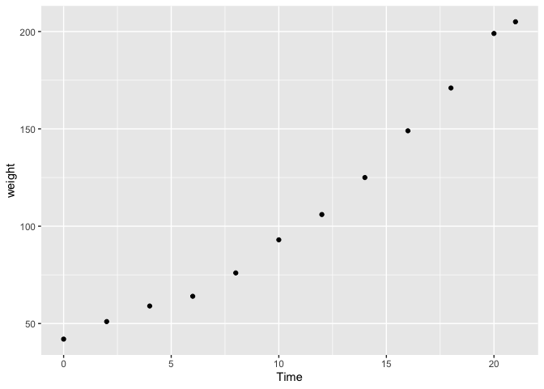

Without a title, axis labels and units of measurement it is impossible
for an outsider to understand what this graph represents. What is this
graph displaying? How is time recorded? What is weight measured in?
Let’s add our **essentials**.

    #We can access axis and title labels with the labs() function

    fig2 = ggplot(data = chick_weight[chick_weight$Chick == 1,], aes(x=Time, y=weight)) + geom_point() + labs(x="Number of Days since Birth", y= "Weight (in grams)", title = "Chick One's Weight over Duration of Study")

    fig2

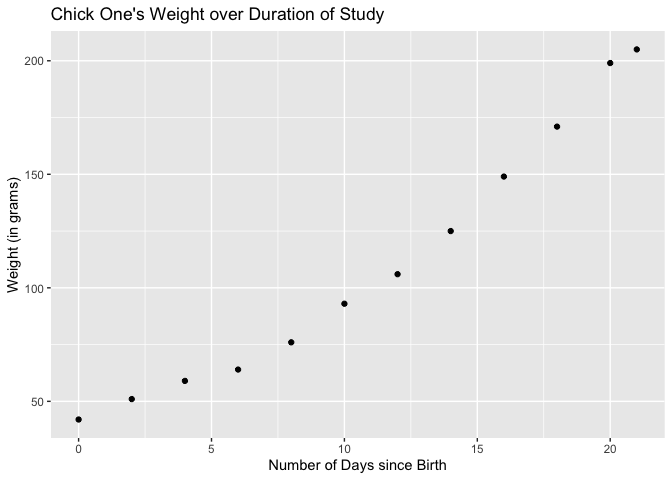

Although our graph is still very basic, it is now at least
interpretable. Let’s quickly look at a case where adding a legend would
be essential: examining chick growth based on diet recieved (a factor
level ranging from 1 to 4).

    fig3 = ggplot(data = chick_weight, aes(x=Time, y=weight)) + geom_point() + labs(x="Number of Days since Birth", y= "Weight (in grams)", title = "Chick Growth Relative to Diet")

    fig3

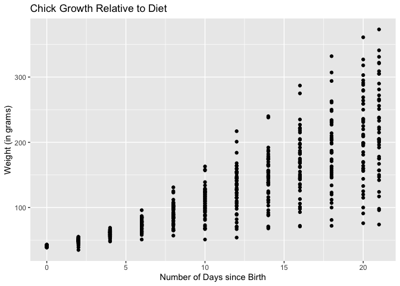

Although we have added a title and axis labels, we are still left with a
useless graph. Which point indicates which diet? It is impossible to
even visually observe any trends in diet. Let’s now add a legend.

    fig4 = ggplot(data = chick_weight, aes(x=Time, y=weight, color = Diet)) + geom_point(alpha = 0.6) + labs(x="Number of Days since Birth", y= "Weight (in grams)", title = "Chick Growth Relative to Diet")

    #We can use assign an 'alpha' to each point so that points stacked ontop of each other are more readable.

    fig4

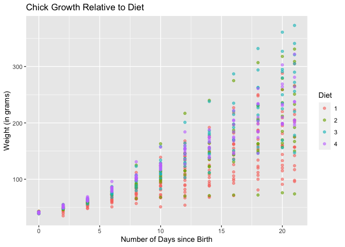

The data is still somewhat messy, due to clumping of data points, but we
can now see which diet chicks had at each point in time. Let’s observe
other legend additions that can be beneficial when working with certain
data sets. For simplicity, let’s subset our data to include 6 random
chicks.

    sub_chick_weight = chick_weight[chick_weight$Chick == 1 | chick_weight$Chick == 28 | chick_weight$Chick == 34 | chick_weight$Chick == 22 | chick_weight$Chick == 45 | chick_weight$Chick == 9,]

    fig4 = ggplot(data = sub_chick_weight, aes(x=Time, y=weight, color = Diet)) + geom_point(alpha = 0.6) + labs(x="Number of Days since Birth", y= "Weight (in grams)", title = "Chick Growth Relative to Diet")

    fig4

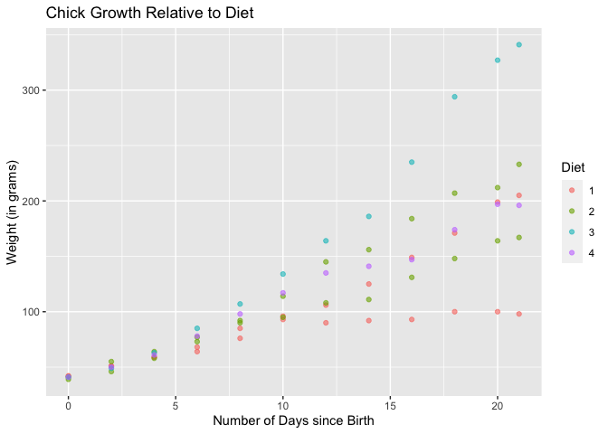

This isn’t awful, but it would be nice to know which chick respective to
each diet was actually being recorded. In this example it is fairly easy
to see the growth of individual chicks, there are not any large
discontinuous jumps or crossings of chicks with the same diet. When
working with larger data sets this issue may be magnified on a much
larger scale. Let’s assign a *size* characteristic to our mapping.

    #Typically, you want to assign size to the variable with less values than color so that your graph is more readable. We switch diet to size and use chick as our color.

    fig5 = ggplot(data = sub_chick_weight, aes(x=Time, y=weight, size = Diet, color = Chick)) + geom_point(alpha = 0.6) + labs(x="Number of Days since Birth", y= "Weight (in grams)", title = "Chick Growth Relative to Diet") + scale_size_discrete()

    ## Warning: Using size for a discrete variable is not advised.

    #We are using scale_size_discrete() because the variable we assigned to our size component is a discrete factor, not a continuous variable.

    fig5

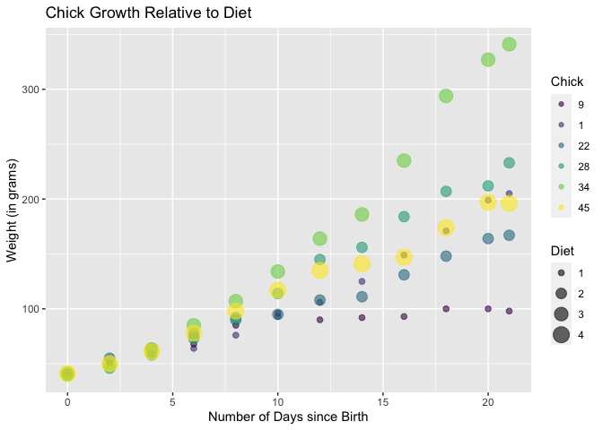

Earlier, it may have proven difficult to determine which chick that was
fed *diet 1* showed the larger growth after roughly 10 days… By using
both size and color to map our points, we can track individual chicks
much more easily. Again, this issue is rather minute here and can be
much more detrimental to other data sets.

### Sidenote

Although we applied our size component to a discrete variable, it is
typically better applied to continuous ones. Let’s take a quick step
back and use this procedure for another data set in base R: *swiss*.
This data set observes fertility measure and socio-economic indicators
for 47 French-speaking provinces in Switzerland in the year 1888. Let’s
add some color to our points, accessing our
[colorbook](http://sape.inf.usi.ch/quick-reference/ggplot2/colour).

    #To change color of a simple point, we add the color option to geom_point().

    fig6 = ggplot(data = swiss, aes(x=Education, y=Infant.Mortality)) + geom_point(color = "dodgerblue",alpha = 0.6) + labs(x="Population with Education past Primary School (in %)", y= "Births with Lifespan Less than One Year (in %)", title = "Mortality Rate Relative to Education (in %)")

    fig6

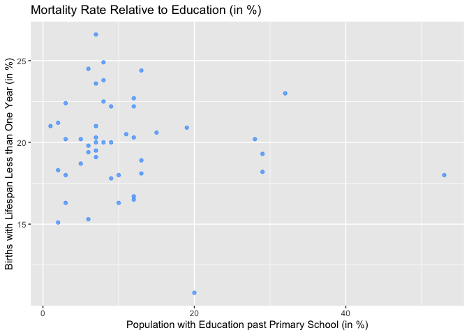

This is fine, but let’s say we believed the percent of males in
agriculture as an occupation had an effect on infant mortality rates. We
can use the size component of our mapping instead of plotting the points
on top of each other.

    fig7 = ggplot(data = swiss, aes(x=Education, y=Infant.Mortality, size = Agriculture)) + geom_point(color = "dodgerblue",alpha = 0.6) + labs(x="Population with Education past Primary School (in %)", y= "Births with Lifespan Less than One Year (in %)", title = "Mortality Rate Relative to Education (in %)")

    fig7

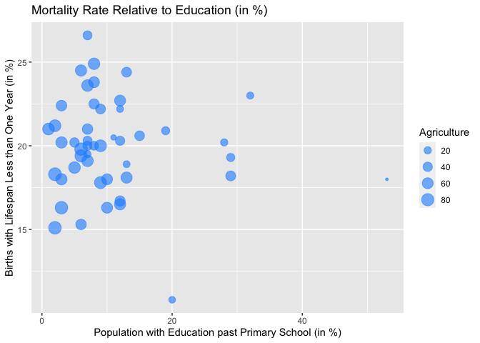

Clearly in this case it is too difficult to determine if agricultural
occupation has an effect on mortality rates, but it is nice to have the
ability to visualize this data with an additional variable in mind.

Hrbrthemes
----------

Now let’s take a look at what the *hrbrthemes* package has to offer.
We’ve gone over the essentials and some coloring/sizing, but
*hrbrthemes* is a nice tool to make the overall theme of the graph more
appealing and professional. Say we are happy with fig5 but we want to
make it prettier. By calling *hrbrthemes* we can choose from a variety
of pre-downloaded themes with previously constructed options.

    #Modern Roboto-Condensed
    fig8 = fig5 + hrbrthemes::theme_modern_rc()  

    fig8

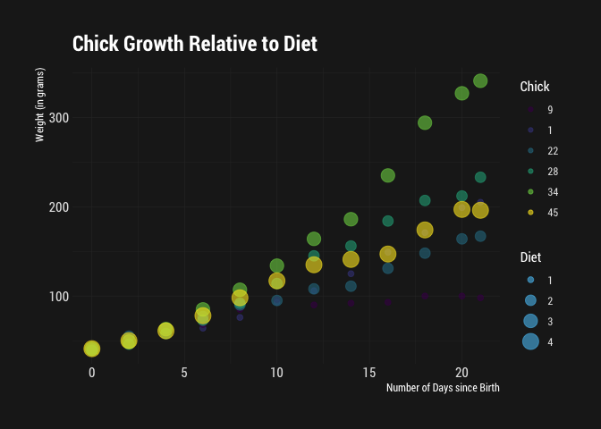

    fig9 = fig5 + hrbrthemes::theme_ipsum_es()  

    fig9

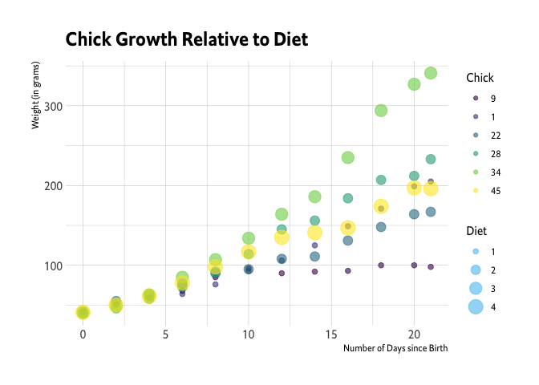

    fig10 = fig5 + hrbrthemes::theme_tinyhand() 

    fig10

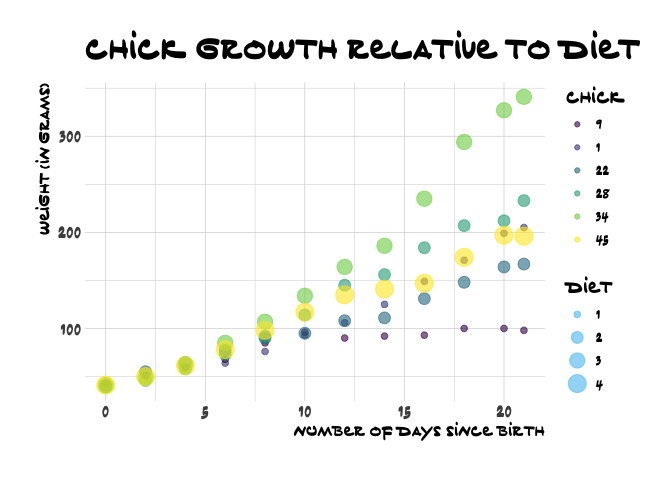

These themes have set fonts, grid structures, axis colors and dozens of
more features to simplify the process on our end. By combing the
knowledge we built in the first section of our implementation with
*hrbrthemes*, we are a big leap forward in producing beautiful graphs
and designs!

Congratulations and good luck with your presntations!
